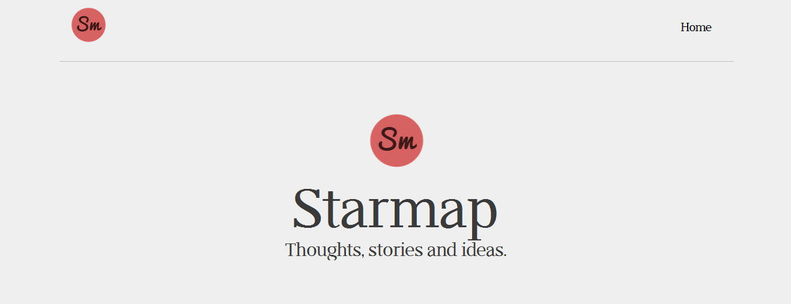
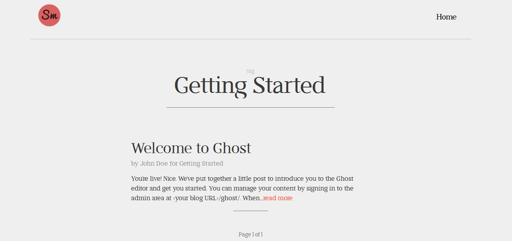
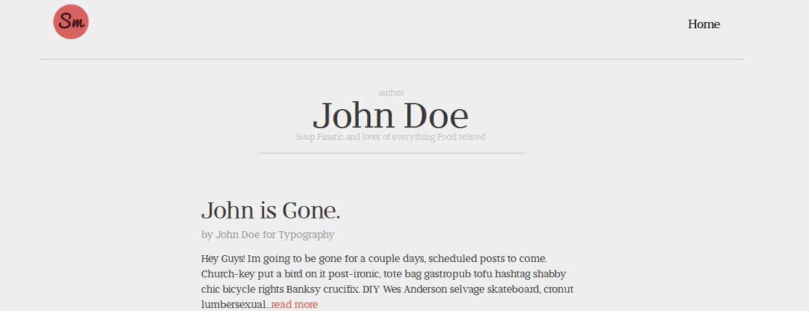
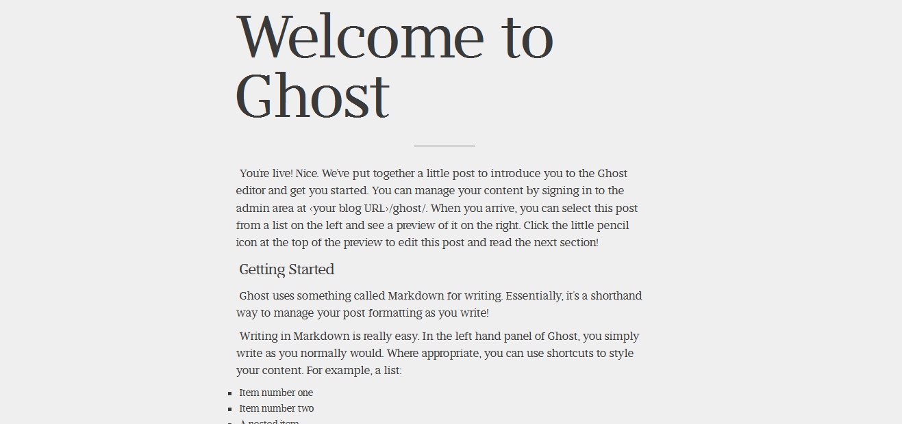
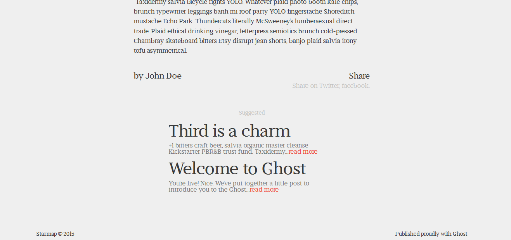
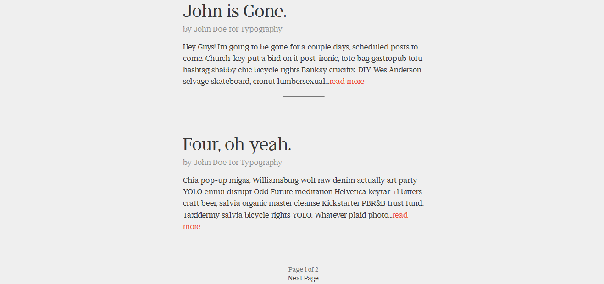

# starmap
a Free, Typographic-Heavy [Ghost](http://ghost.org) Theme.

If you have any suggestions or comments on this theme, Tweet me [@CodeHands](https://twitter.com/CodeHands) or [create a new issue](https://github.com/DanielTamkin/starmap/issues).
Also if you've got an idea on how to make Starmap better, [create a new issue](https://github.com/DanielTamkin/starmap/issues).

### Installation
1. Install Starmap to your Themes directory located at `ghost\content\themes`
2. login to your ghost admin panel
3. navigate to your `settings/general` panel
4. Change your Theme setting to `Starmap`

### Front Page

### Tag

### Author

### Post

### Suggested

### Loop

Details
---
| Fonts  |
| ------------- | ------------- |
| [Didactic](http://www.tylerfinck.com/didactic/)  |

